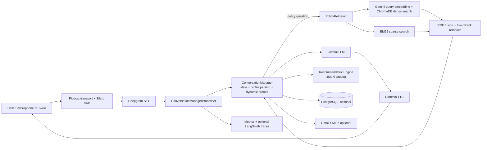

# Project Context: Insurance Policy Recommendation Voice AI Agent

## How to use this document

This is a technical and product handoff for an AI assistant working on this repository. Treat the **implemented system** sections as the source of truth. The **intended direction** and **roadmap** sections distinguish the broader product vision from features that are not yet implemented or integrated.

Do not assume external credentials, PostgreSQL, Gmail, Twilio, ngrok, or LangSmith are configured. Never request, print, or commit secrets from `.env`.

## One-sentence summary

This repository is a Python proof of concept for a real-time, voice-based insurance advisor that collects a caller's requirements in a deterministic flow, answers policy questions using grounded hybrid RAG, recommends matching policies from a local catalog, and can optionally persist data, email documents, and place/receive Twilio calls.

## Product goal

The immediate goal is to demonstrate an insurance-policy advisory call agent, named **Riya**, for the Indian market. It should:

1. Speak with a caller through a microphone/speaker or Twilio phone call.
2. Convert speech to text, maintain a controlled qualification flow, and generate short spoken replies.
3. Collect the minimum information needed to recommend an insurance plan.
4. Answer detailed policy-document questions only from retrieved document context, rather than relying on model knowledge.
5. Rank policies from a structured catalog against the caller's constraints.
6. Optionally save the customer profile, send policy material by email after email confirmation, and trace operational metrics.

The broader business goal described in the project documents is a white-label enterprise voice-agent framework. Insurance is the concrete vertical currently implemented; sales qualification, healthcare, collections, support, CRM/SMS tools, dashboards, and other verticals are product directions, not complete features in this codebase.

## What is implemented today

### Primary user journeys

| Journey | Status | What happens |
| --- | --- | --- |
| Local voice demo | Implemented | `main.py --mode mic` opens a Pipecat local-audio pipeline: microphone -> STT -> conversation control -> Gemini -> TTS -> speaker. |
| Outbound Twilio call | Implemented, configuration-dependent | `main.py --mode twilio --phone <number>` starts a FastAPI server, exposes it through ngrok or `PUBLIC_URL`, triggers a Twilio call, and streams call audio through WebSockets. |
| Insurance question answering | Implemented, knowledge-base-dependent | A detected policy question retrieves chunks from ChromaDB/BM25, reranks them, and puts that context into the per-turn Gemini system prompt. |
| Policy recommendation | Implemented | After all required profile fields are captured, a rule-based engine filters and scores policies from `recommendation/policy_catalog.json`. |
| Policy-document ingestion | Implemented, credentials-dependent | A selected PDF is extracted and validated, then staged across ChromaDB and optional PostgreSQL before an atomic catalogue publication activates the complete version. |
| Profile persistence | Optional | PostgreSQL is initialized automatically when reachable; otherwise the agent continues in memory. |
| Recommendation email | Optional | Gmail SMTP sends an HTML recommendation email, and can attach a policy PDF stored in PostgreSQL or available locally. The caller must explicitly confirm the parsed email address first. |
| Browser frontend | Implemented | `frontend/` connects to the backend `/events` WebSocket and displays caller/assistant messages plus live processing activity. |

## Architecture



### Runtime pipeline

Both microphone and Twilio modes construct essentially the same Pipecat pipeline:

`input transport -> metrics processor -> Deepgram STT -> user context aggregator -> ConversationManagerProcessor -> Gemini -> Cartesia TTS -> metrics processor -> output transport -> assistant context aggregator`

`ConversationManagerProcessor` is the important control point. On each user turn it:

1. records the transcript and starts latency tracking;
2. identifies whether the utterance looks like a policy question;
3. retrieves up to five relevant policy chunks when applicable;
4. passes the turn and retrieved chunks to `ConversationManager`;
5. persists the profile when PostgreSQL is available;
6. triggers an email only after a confirmed email and delivered recommendations;
7. replaces Gemini's system instruction with a newly built, state-aware prompt.

On assistant turns it records the reply and, when enabled, sends a best-effort LangSmith trace. Trace failures are deliberately swallowed so they do not end the voice call.

## Conversation design and control approach

The project deliberately does **not** let the LLM decide the business workflow. It uses an explicit finite-state machine plus rule-based profile extraction; Gemini primarily produces the spoken response under a dynamically generated prompt.

### States

| State | Purpose |
| --- | --- |
| `GREETING` | Introduce Riya and obtain the caller's name. |
| `COLLECTING_INFORMATION` | Ask the next unanswered required profile question. |
| `ANSWERING_POLICY_QUESTIONS` | Temporarily answer a policy-specific question using retrieved text only. |
| `RECOMMENDING_POLICY` | Present catalog recommendations after the required profile is complete. |
| `ENDING_CALL` | Close the call after a detected end-of-call intent. |

Policy questions are a side trip: after answering, the manager derives the next state again from profile completeness and caller intent. Illegal state changes raise `InvalidStateTransitionError`.

### Required qualification fields, in order

1. Age
2. Plan type / family size (`Individual` or `Family Floater`)
3. Smoking or tobacco habit
4. Annual premium budget
5. Desired sum insured / coverage amount

Optional fields include marital status, occupation, annual income, and preferred insurer. The `CustomerProfile` model can also store name, gender, city, family details, diseases, current insurer, and email.

Parsing is intentionally lightweight and local: regexes/keywords parse spoken numbers (including lakh/crore), ages, amounts, yes/no answers, family size, diseases, insurer names, and spoken email addresses. If parsing is uncertain, the field remains empty and the next prompt asks again. This is simple, testable, and low-latency, but it is not a robust general NLU system.

### Prompt guardrails

Every generated system prompt instructs the LLM to keep replies short and conversational, ask at most one question, follow the required order, avoid asking known fields again, and remain in insurance scope. For policy Q&A it must use only supplied retrieved context; with no usable context, it is instructed to answer exactly: `Sorry, I am unaware of it.`

For email, the system parses a candidate address into `pending_email`, speaks it character by character, and waits for an explicit confirmation before setting `email_confirmed` or sending anything.

## RAG and document-ingestion approach

### Ingestion

`run_ingestion.py` launches a file picker (or falls back to a terminal path). `ingestion.pdf_processor.process_policy_pdf()` then:

1. extracts text from a PDF using PyMuPDF, with OCR support/fallback logic in `ingestion/text_extractor.py` for difficult pages;
2. applies a local insurance-keyword precheck;
3. asks Gemini for strict structured extraction and insurance-document classification using a Pydantic schema;
4. rejects documents that fail classification or lack a policy name/insurer;
5. upserts extracted metadata into `recommendation/policy_catalog.json` by `policy_id`;
6. chunks the document semantically (default 500 characters with 50-character overlap);
7. generates Gemini `gemini-embedding-001` embeddings (document batches of 16, with rate-limit retries);
8. upserts chunks and embeddings into the local persistent Chroma collection `insurance_policies`;
9. optionally stores policy text, metadata, path, and PDF bytes in PostgreSQL.

### Retrieval

`PolicyRetriever` uses hybrid retrieval:

1. Gemini embeds the query.
2. ChromaDB returns dense-vector candidates.
3. A BM25 index over stored chunks returns sparse keyword candidates.
4. Reciprocal Rank Fusion merges the two ranked lists.
5. FlashRank cross-encoder reranking returns the final highest-scoring chunks.

The system includes `RAGPipeline` for standalone question answering and evaluation scripts with factual, coverage, and negative/anti-hallucination test cases. The repository documentation reports strong historical validation numbers, but those results were not rerun for this handoff and should not be treated as a current benchmark.

## Recommendation approach

`RecommendationEngine` loads the local JSON catalog (currently 9 policy entries) into `Policy` objects. It filters on:

- individual versus family-floater fit;
- entry-age range;
- smoker eligibility;
- diabetes/hypertension coverage when relevant;
- parents/children inclusion;
- budget and desired coverage in strict mode.

If strict budget/coverage filters yield nothing, it retries with only those two constraints relaxed. Eligible policies receive a deterministic heuristic score: budget savings or overage, coverage excess or deficit, preferred insurer match, and plan-type fit. The top three are provided to the prompt for spoken presentation and email content.

This is not a learned recommendation model, pricing engine, underwriting engine, or regulatory suitability engine. It is a transparent catalog-matching heuristic for the PoC.

## Storage, integrations, and observability

### Local repository data

- `Data/` contains the insurance PDFs and several extracted Markdown documents used as source material.
- `recommendation/policy_catalog.json` is the structured recommendation catalog.
- `chroma_db/` is an existing persistent ChromaDB store and should be treated as derived data. Re-ingestion changes it.

### PostgreSQL (optional)

`PostgresDBManager` attempts to create/connect to the configured database and creates:

- `customer_profiles` — one JSONB profile per call session; the legacy `conversation_history` column is preserved for compatibility;
- `conversation_sessions` — call lifecycle and session metadata;
- `conversation_messages` — append-only, idempotent messages ordered by sequence;
- `policy_documents` — policy metadata, text, path, and optional raw PDF bytes;
- `policy_ingestions` — staged ingestion state and failure context;
- `sent_email_logs` — delivery success/failure logs.

When database connection or the `psycopg2` package is unavailable, the program prints a warning and runs without persistence.

The database manager non-destructively migrates legacy JSONB histories into append-only message rows. Reads prefer the ordered message table and fall back to legacy JSONB. PostgreSQL work is queued outside the response-critical frame path, and deterministic message IDs prevent duplicate inserts.

### Email (optional)

`EmailService` uses Gmail SMTP with TLS. It creates an HTML email containing recommended policies and, when available, attaches the top policy PDF from PostgreSQL or its stored local path. It logs delivery status if a database manager is available.

### Telephony

`TwilioService` creates outbound calls and TwiML that points Twilio Media Streams at the FastAPI WebSocket endpoint. `server.py` exposes:

- `GET`/`POST /twiml` — TwiML returned to Twilio;
- `WebSocket /ws` — bidirectional audio/media stream handled by a Pipecat Twilio serializer.

The Twilio launcher uses an explicit `PUBLIC_URL` when supplied; otherwise it starts an ngrok tunnel.

### Metrics and tracing

`core.metrics_tracker` uses one tracker per call. Input timing and service/native metric collection have separate owners to avoid duplicate counts. Provider usage metadata is authoritative when available; local estimates do not make remote token-counting calls. LangSmith uses a bounded background queue and is flushed on shutdown. Treat prompts/transcripts as potentially sensitive customer data when enabling it.

## Technology stack

| Area | Technology |
| --- | --- |
| Language/runtime | Python 3.10+ (per README) |
| Real-time orchestration | Pipecat |
| Voice activity detection | Silero VAD |
| Speech-to-text | Deepgram (`nova-3` default) |
| LLM and embeddings | Google Gemini (`gemini-3.1-flash-lite` and `gemini-embedding-001` defaults) |
| Text-to-speech | Cartesia (`sonic-2` default) |
| Dense vector database | ChromaDB |
| Sparse retrieval | BM25 / `rank-bm25` |
| Reranking | FlashRank |
| PDF extraction/OCR | PyMuPDF, PaddleOCR/PaddlePaddle |
| Database | PostgreSQL via psycopg2 |
| Telephony/server | Twilio, FastAPI, Uvicorn, pyngrok |
| Observability | LangSmith |
| Web UI scaffold | React 19 + Vite 8 (not connected) |

## Repository map

| Path | Responsibility |
| --- | --- |
| `main.py` | CLI entry point, microphone pipeline, Twilio-mode launcher, reusable `ConversationManagerProcessor`. |
| `server.py` | FastAPI TwiML/WebSocket server for Twilio Media Streams. |
| `core/config.py` | Environment loading, defaults, and credential validation. |
| `core/metrics_tracker.py` | Voice/RAG metrics collection and reporting. |
| `conversation/` | Profile schema/parsers, ordered questions, allowed states, manager, and dynamic prompts. |
| `rag/` | Chunk models, semantic chunker, Gemini embeddings, Chroma store, hybrid retriever, reranker, standalone RAG pipeline. |
| `ingestion/` | PDF text extraction, structured metadata extraction, and end-to-end policy ingestion. |
| `recommendation/` | Policy dataclass, JSON catalog, rule-based filtering/scoring. |
| `database/db_manager.py` | Optional PostgreSQL schema and persistence methods. |
| `services/twilio_service.py` | Outbound Twilio call, TwiML, ngrok support. |
| `services/email_sender.py` | Gmail SMTP recommendation email and attachment behavior. |
| `observability/langsmith_tracer.py` | Best-effort LangSmith tracing and cost estimates. |
| `evaluation/` | RAG validation and relevance-analysis scripts. |
| `Data/` | Sample insurance-policy source PDFs/Markdown. |
| `frontend/` | Integrated React/Vite live conversation and activity dashboard. |
| `README.md`, `flowchart.md`, `Voice_AI_Agent_Use_Cases_and_Analysis.md` | Product/demo narrative; some statements are aspirational. |

## Configuration

Required for normal voice operation:

```env
DEEPGRAM_API_KEY=
GOOGLE_API_KEY=
CARTESIA_API_KEY=
```

Optional integrations/configuration:

```env
# Optional RAG acceptance threshold
RAG_MIN_RELEVANCE_SCORE=0.05

# PostgreSQL
POSTGRES_HOST=localhost
POSTGRES_PORT=5432
POSTGRES_DB=voice_ai_db
POSTGRES_USER=postgres
POSTGRES_PASSWORD=postgres
DATABASE_URL=

# Gmail SMTP
SMTP_SERVER=smtp.gmail.com
SMTP_PORT=587
GMAIL_SENDER_EMAIL=
GMAIL_APP_PASSWORD=

# Twilio and public webhook exposure
TWILIO_ACCOUNT_SID=
TWILIO_AUTH_TOKEN=
TWILIO_PHONE_NUMBER=
PUBLIC_URL=
NGROK_AUTHTOKEN=
PORT=8765

# LangSmith
LANGSMITH_TRACING=true
LANGSMITH_API_KEY=
LANGSMITH_PROJECT=Voice-AI-Agent
```

Defaults are defined in `core/config.py`. Model and voice defaults can also be overridden with `DEEPGRAM_MODEL`, `DEEPGRAM_LANGUAGE`, `GEMINI_MODEL`, `GEMINI_SYSTEM_PROMPT`, `CARTESIA_MODEL`, and `CARTESIA_VOICE_ID`.

## How to run and validate

```powershell
# Install Python dependencies in an activated virtual environment
pip install -r requirements.txt

# Ingest one policy PDF through the interactive picker/path prompt
python run_ingestion.py

# Run the local microphone/speaker agent
python main.py --mode mic

# Run local voice mode with the live conversation dashboard event server (default)
python main.py --mode mic

# Start an outbound Twilio call (requires Twilio + public URL/ngrok config)
python main.py --mode twilio --phone +919876543210

# Run the RAG validation scripts
python evaluation/validate_rag.py
python evaluation/test_relevance_scores.py
```

The frontend has its own Node project. Run `npm install` then `npm.cmd run dev` in `frontend/` after starting `python main.py --mode mic` (on PowerShell systems where `npm.ps1` is blocked; otherwise `npm run dev` also works). It connects to `ws://localhost:8765/events` by default and displays completed transcripts plus a best-effort activity feed. Set `VITE_EVENTS_URL` to override that WebSocket URL. Use `--no-dashboard` only when the event feed is not needed.

## Current limitations and risks

1. **The live dashboard is display-only and local/demo-oriented.** It receives a WebSocket event feed but has no authentication, session selector, backend APIs beyond events, or controls for a call.
2. **No authentication, authorization, tenant isolation, rate limiting, audit controls, or production secrets management.** This is a PoC, not production-ready handling for regulated personal/health/financial data.
3. **RAG grounding depends on retrieval quality.** Production and evaluation share a score threshold and fallback, but the sample evaluation corpus remains small and spoken responses do not provide formal citations.
4. **Profile parsing is heuristic.** It can miss unusual phrasing, multilingual/Indian-language speech nuances, transcription errors, corrections, and complex family/medical responses.
5. **Policy eligibility and recommendation are simplified.** The catalog is local/static and the scoring rules should not be used as actual underwriting, binding, quotation, or regulated advice.
6. **Email integration can expose sensitive data.** Delivery status is truthful, but consent, encryption, data retention, document authorization, and production retry policy still need deployment-specific decisions.
7. **Twilio call operation requires reliable public networking.** The local FastAPI/ngrok flow is demo-oriented; there is no deployment, queueing, retry, call-recording policy, or webhook verification layer.
8. **Database is optional and failure-tolerant.** Calls can continue in memory, but data is then not durable.
9. **Metrics/tracing may contain personal data and prompts.** LangSmith should be configured only with a deliberate privacy/compliance decision.
10. **Documentation contains promotional and historical claims.** Validate cost, latency, accuracy, and ROI claims independently; do not present them as measured current production guarantees.

## Suggested next development plan

Prioritize this sequence unless the user gives a different product direction:

1. Expand the focused regression suite with full transport-level Twilio/microphone tests when reliable Pipecat transport fakes are available.
2. Add deployment artifacts such as Docker/Compose, startup health checks, and a clear local/production configuration split.
3. Replace or augment regex parsing with schema-validated structured extraction for difficult turns, while retaining deterministic validation and explicit confirmation for sensitive values.
4. Strengthen RAG with a larger evaluation dataset, source citations, and calibrated per-domain threshold benchmarks.
5. Extend the existing display-only dashboard only when operator controls and session ownership are explicitly required.
6. Harden the system for regulated deployment: authentication, consent, PII protection, retention/deletion, encryption, audit logs, tenant boundaries, and human escalation.
7. Add enterprise tools only after their contracts are defined: CRM logging, appointment booking, SMS, payment links, live-agent transfer, and policy lifecycle integrations.
8. Generalize the domain layer so insurance remains one configurable vertical rather than hardcoded application behavior.

## Instructions for a future ChatGPT collaborator

When helping with this project:

- Preserve the separation between deterministic conversation/business control and LLM-generated wording.
- Treat `ConversationManager`, `question_flow`, and `prompts` as safety-critical behavior: avoid making the LLM freely choose required questions, send email without confirmation, or answer policy details without retrieved context.
- Prefer changes that are testable without paid external services; isolate adapters around Deepgram, Gemini, Cartesia, Twilio, Gmail, PostgreSQL, and LangSmith.
- Do not claim a feature is complete merely because it appears in README or sales material. Check whether it is wired into the runtime.
- Keep voice responses concise and speech-friendly; avoid lists/Markdown in prompts intended for TTS.
- Treat insurance and customer data as sensitive. Do not log or expose secrets, raw documents, email addresses, health information, or transcripts without an explicit reason and appropriate protection.
- If asked to productionize, begin by clarifying jurisdiction, compliance requirements, data residency, target telephony region, user consent, and human-handoff requirements.

## Knowledge-graph audit note

The repository was indexed before this document was created. The code graph contained 708 nodes and 2,133 relationships, and identified `main.py` and `run_ingestion.py` as entry points. The strongest implementation clusters are RAG/ingestion, conversation control, database/services, and recommendation. This document additionally inspected the source and project documents so that the status labels above distinguish connected code from product narrative.
