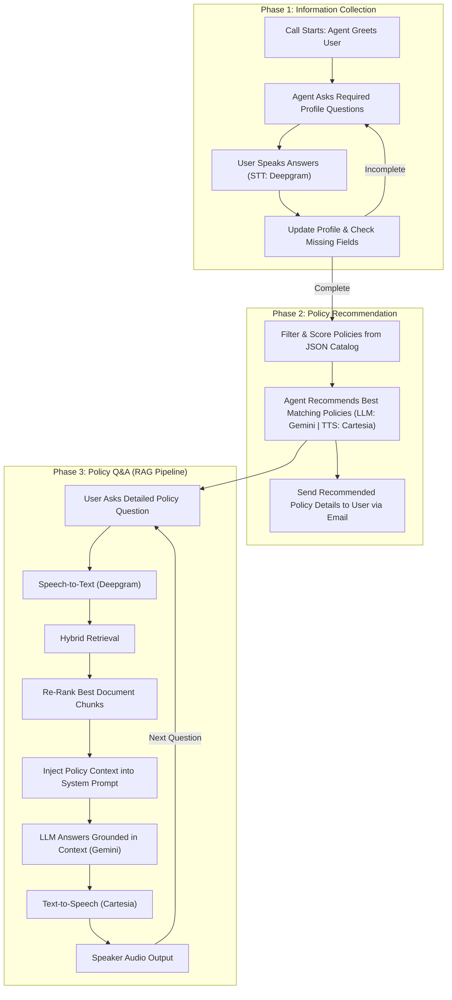

```mermaid
flowchart TD
    subgraph Phase1 ["Phase 1: Information Collection"]
        Start["Call Starts: Agent Greets User"] --> AskQ["Agent Asks Required Profile Questions"]
        AskQ --> UserAnswer["User Speaks Answers (STT: Deepgram)"]
        UserAnswer --> UpdateProfile["Update Profile & Check Missing Fields"]
        UpdateProfile -->|Incomplete| AskQ
    end

    subgraph Phase2 ["Phase 2: Policy Recommendation"]
        UpdateProfile -->|Complete| MatchEngine["Filter & Score Policies from JSON Catalog"]
        MatchEngine --> RecPolicy["Agent Recommends Best Matching Policies (LLM: Gemini | TTS: Cartesia)"]
        RecPolicy --> SendMail["Send Recommended Policy Details to User via Email"]
    end

    subgraph Phase3 ["Phase 3: Policy Q&A (RAG Pipeline)"]
        RecPolicy --> UserQ["User Asks Detailed Policy Question"]
        UserQ --> STT2["Speech-to-Text (Deepgram)"]
        STT2 --> RAG["Hybrid Retrieval"]
        RAG --> Reranker["Re-Rank Best Document Chunks"]
        Reranker --> Prompt["Inject Policy Context into System Prompt"]
        Prompt --> LLM["LLM Answers Grounded in Context (Gemini)"]
        LLM --> TTS["Text-to-Speech (Cartesia)"]
        TTS --> Speaker["Speaker Audio Output"]
        Speaker -->|Next Question| UserQ
    end
```