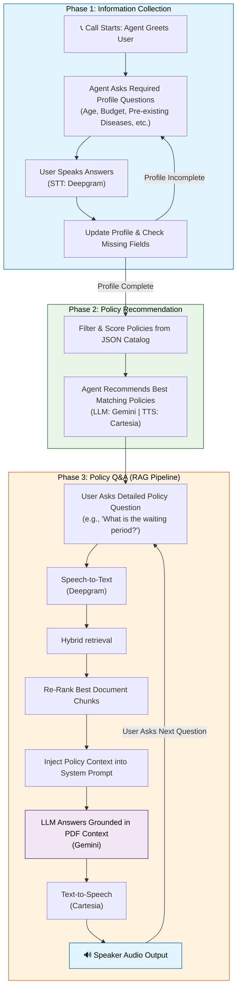

flowchart TD

    Start["Call Starts: Agent Greets User"]
    Start --> AskQ["Agent Asks Required Profile Questions (Age, Budget, Diseases, etc.)"]
    AskQ --> UserAnswer["User Speaks Answers (STT: Deepgram)"]
    UserAnswer --> UpdateProfile["Update Profile & Check Missing Fields"]
    UpdateProfile -->|Profile Incomplete| AskQ

    UpdateProfile -->|Profile Complete| MatchEngine["Filter & Score Policies from JSON Catalog"]
    MatchEngine --> RecPolicy["Agent Recommends Best Matching Policies (Gemini + Cartesia)"]

    RecPolicy --> SendMail["Send Recommended Policy Details via Email"]

    RecPolicy --> UserQ["User Asks Detailed Policy Question"]
    UserQ --> STT2["Speech-to-Text (Deepgram)"]
    STT2 --> RAG["Hybrid Retrieval"]
    RAG --> Reranker["Re-Rank Best Document Chunks"]
    Reranker --> Prompt["Inject Policy Context into Prompt"]
    Prompt --> LLM["Gemini Generates Grounded Answer"]
    LLM --> TTS["Cartesia Text-to-Speech"]
    TTS --> Speaker["Speaker Output"]
    Speaker -->|Next Question| UserQ# Voice AI Agent Sequential Flowchart

A simple high-level overview showing the 3 sequential phases of the call:
1. **Information Collection** (Asking profile questions)
2. **Policy Recommendation** (Recommending best fits from JSON catalog)
3. **Deep Query Answering** (Using RAG for follow-up questions)

